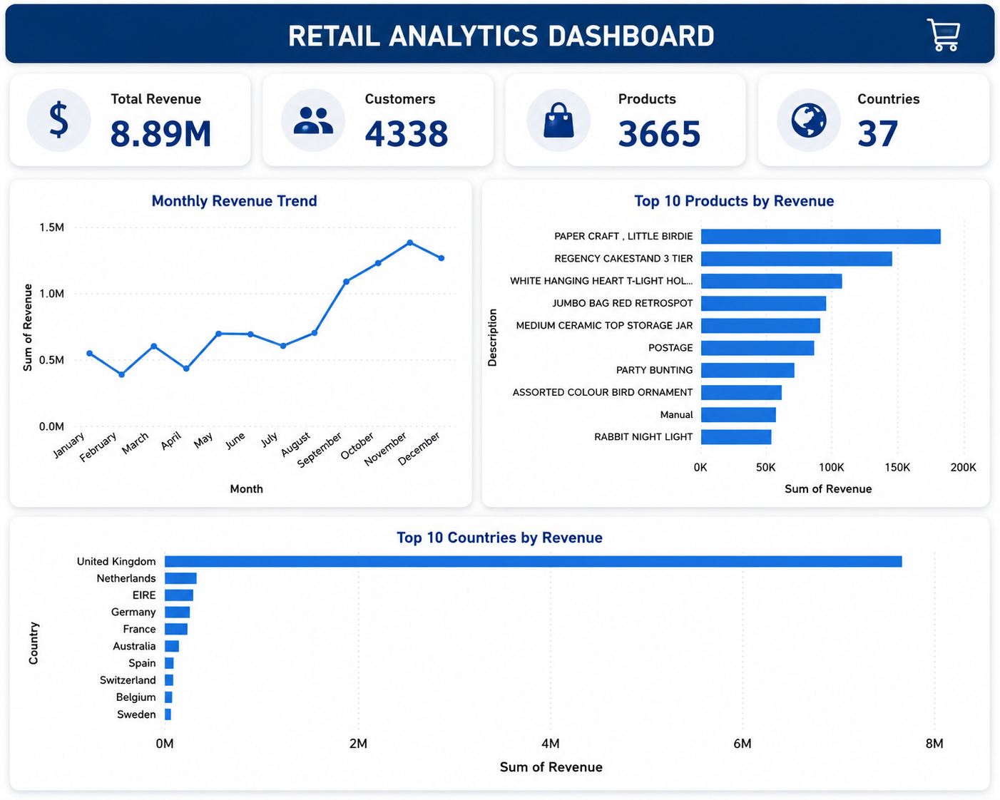
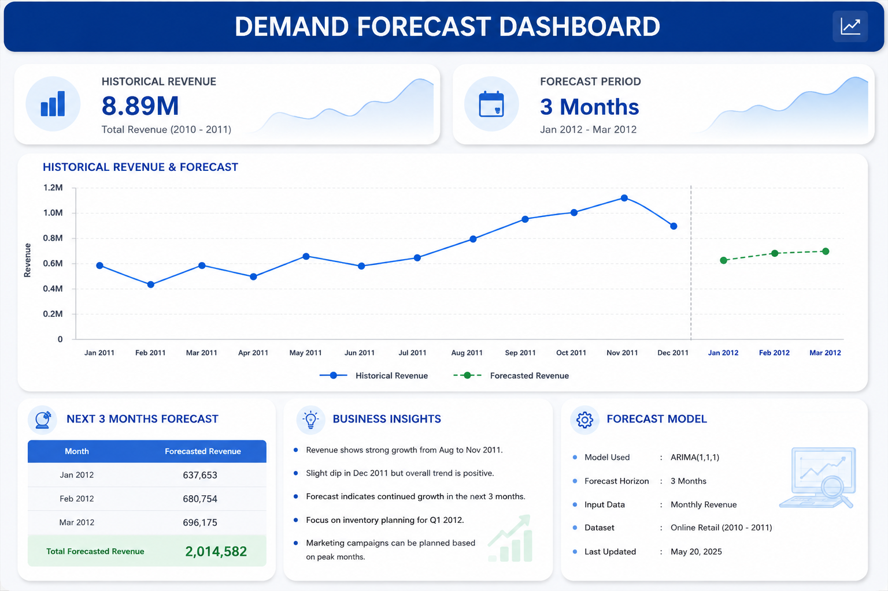

# Retail Analytics & Revenue Forecasting

## 🚀 Live Demo

🌐 **Streamlit App:**  
https://rvrrithwik28retailanalyticsforecasting.streamlit.app/

---

## 📌 Project Overview

Analyzed 392K+ retail transactions using Python, SQL, MySQL and Power BI.

Retail businesses generate large volumes of transactional data that can be difficult to interpret and use for decision-making.

This project transforms raw retail transaction data into an interactive analytics platform that helps answer questions such as:

- How much revenue is being generated?
- Which countries contribute the most revenue?
- What are the monthly revenue trends?
- How many customers and orders are being handled?
- What are the top-performing products?
- What can we expect from future revenue?

The project combines **data engineering, SQL analytics, visualization, and time-series forecasting** into a single platform.

---

## ✨ Key Features

- Data Cleaning & Preprocessing
- Exploratory Data Analysis (EDA)
- SQL Business Analytics
- Star Schema Data Modeling
- Revenue Forecasting using SARIMA
- Interactive Power BI Dashboard


### 📊 Executive Dashboard

- Total Revenue
- Total Orders
- Total Customers
- Number of Countries
- Monthly Revenue Analysis
- Interactive Country Filtering
- Executive Business Summary

### 🌍 Country Analytics

- Country-wise revenue analysis
- Country filtering
- Revenue comparison
- Country-level business insights

### 📈 Monthly Sales Analysis

- Monthly revenue trends
- Historical sales visualization
- Interactive Plotly charts
- Filtered monthly analysis based on selected country

### 🔮 Revenue Forecasting

- Time-series forecasting using **ARIMA**
- Future revenue prediction
- Historical vs Forecast visualization
- Next 3 months revenue forecasting

### 👥 Customer Analytics

- Total customer count
- Average order value
- Customer revenue analysis
- Top 10 customers by revenue
- Customer-level business insights

### 📥 Data Export

- Export monthly sales data as CSV
- Exported data reflects the selected dashboard analysis

---

## 🏗️ Data Architecture

The project follows a **Star Schema** design.

```text
                    ┌───────────────┐
                    │   dim_date    │
                    └───────┬───────┘
                            │
                            │
┌───────────────┐     ┌─────▼─────┐     ┌───────────────┐
│ dim_customer  │────▶│ fact_sales │◀────│ dim_product   │
└───────────────┘     └─────┬─────┘     └───────────────┘
                            │
                            │
                    ┌───────▼───────┐
                    │  dim_country  │
                    └───────────────┘


## Tech Stack
- Python
- Pandas
- MySQL
- Power BI
- Statsmodels (SARIMA)

## Key Insights
- Total Revenue: 8.89M
- Customers: 4,338
- Products: 3,665
- Countries: 37

## 📊 Power BI Dashboard

The project also includes an interactive Power BI dashboard designed for
business-level reporting and decision-making.

## Dashboard


## Forecast
Generated next 3 months revenue forecast using SARIMA model.


