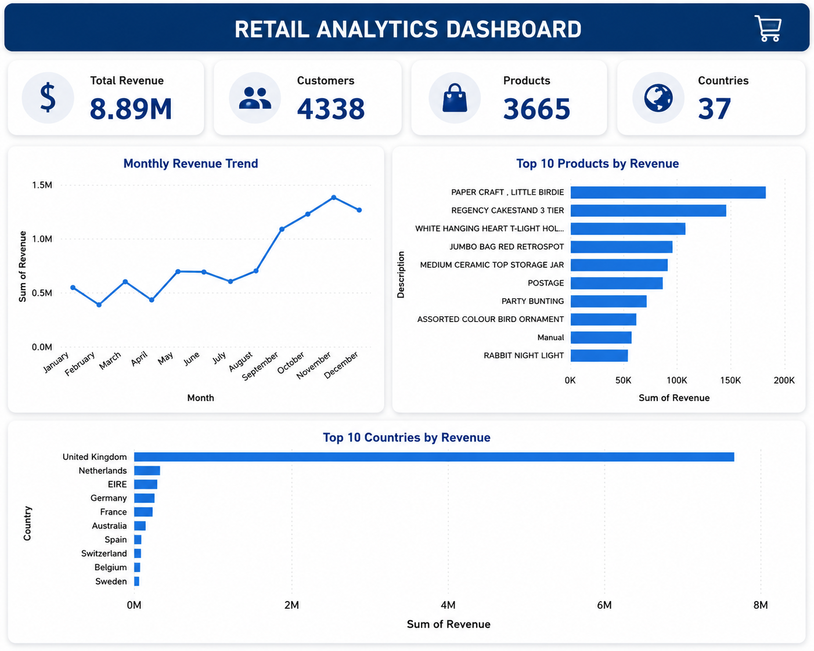
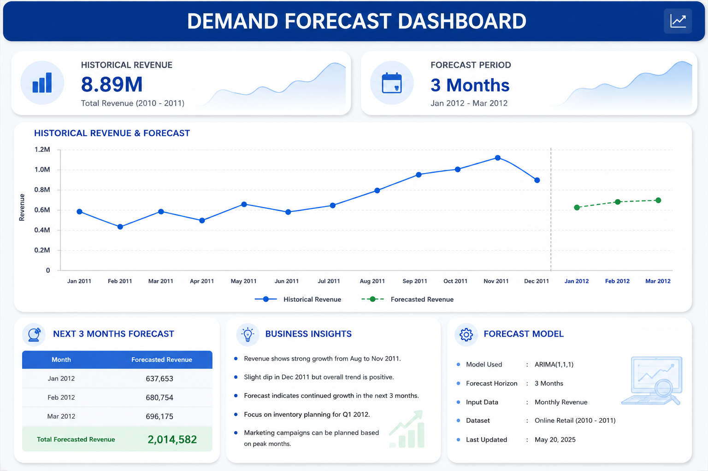

# Retail Analytics & Revenue Forecasting

## 🚀 Live Demo

🌐 **Streamlit App:**  
https://rvrrithwik28retailanalyticsforecasting.streamlit.app/

---

## 📌 Project Overview

Analyzed 392K+ retail transactions using Python, SQL, MySQL and Power BI.

Retail businesses generate large volumes of transactional data that can be difficult to interpret and use for decision-making.

This project transforms raw retail transaction data into an interactive analytics platform that helps answer questions such as:

- How much revenue is being generated?
- Which countries contribute the most revenue?
- What are the monthly revenue trends?
- How many customers and orders are being handled?
- What are the top-performing products?
- What can we expect from future revenue?

The project combines **data engineering, SQL analytics, visualization, and time-series forecasting** into a single platform.


## ✨ Key Features

- Data Cleaning & Preprocessing
- Exploratory Data Analysis (EDA)
- SQL Business Analytics
- Star Schema Data Modeling
- Revenue Forecasting using SARIMA
- Interactive Power BI Dashboard


### 📊 Executive Dashboard

- Total Revenue
- Total Orders
- Total Customers
- Number of Countries
- Monthly Revenue Analysis
- Interactive Country Filtering
- Executive Business Summary

### 🌍 Country Analytics

- Country-wise revenue analysis
- Country filtering
- Revenue comparison
- Country-level business insights

### 📈 Monthly Sales Analysis

- Monthly revenue trends
- Historical sales visualization
- Interactive Plotly charts
- Filtered monthly analysis based on selected country

### 🔮 Revenue Forecasting

- Time-series forecasting using **ARIMA**
- Future revenue prediction
- Historical vs Forecast visualization
- Next 3 months revenue forecasting

### 👥 Customer Analytics

- Total customer count
- Average order value
- Customer revenue analysis
- Top 10 customers by revenue
- Customer-level business insights

### 📥 Data Export

- Export monthly sales data as CSV
- Exported data reflects the selected dashboard analysis

---

## Tech Stack
- Python
- Pandas
- MySQL
- Power BI
- Statsmodels (SARIMA)

## Key Insights
- Total Revenue: 8.89M
- Customers: 4,338
- Products: 3,665
- Countries: 37

## 📊 Power BI Dashboard

The project also includes an interactive Power BI dashboard designed for
business-level reporting and decision-making.



## Forecast
Generated next 3 months revenue forecast using SARIMA model.




## 🏗️ Data Architecture

The project follows a **Star Schema** design.

```text
                    ┌───────────────┐
                    │   dim_date    │
                    └───────┬───────┘
                            │
                            │
┌───────────────┐     ┌─────▼─────┐     ┌───────────────┐
│ dim_customer  │────▶│ fact_sales │◀────│ dim_product   │
└───────────────┘     └─────┬─────┘     └───────────────┘
                            │
                            │
                    ┌───────▼───────┐
                    │  dim_country  │
                    └───────────────┘
```


## ✨ Key Features

### 📊 Executive Analytics Dashboard

- Total Revenue
- Total Orders
- Total Customers
- Number of Countries
- Monthly Revenue Analysis
- Interactive Country Filtering
- Top Product Analysis
- Country Revenue Analysis
- Business Insights

### 🌍 Country Analytics

- Country-level revenue analysis
- Interactive country filtering
- Revenue comparison
- Orders and customer metrics
- Country-specific monthly sales analysis

### 📈 Monthly Sales Analysis

- Monthly revenue trends
- Historical revenue visualization
- Interactive Plotly charts
- Country-filtered monthly analysis
- Chronological time-series visualization

### 🔮 Revenue Forecasting

The platform implements two forecasting approaches:

#### SARIMA

Seasonal AutoRegressive Integrated Moving Average forecasting for monthly revenue time series.

#### TensorFlow LSTM

A Long Short-Term Memory neural network implemented using TensorFlow for nonlinear time-series forecasting.

The platform performs a common validation split so the two models can be evaluated using:

- MAE
- RMSE
- MAPE

Forecast results are stored in Snowflake and displayed through the Streamlit dashboard.

### ⚡ What-If Forecast Simulator

The dashboard includes an interactive scenario simulator.

Users can apply a simulated growth or decrease factor to the forecast:

```text
Simulated Forecast =
Forecast × (1 + Growth Factor / 100)
```

### 👥 Customer Analytics

- Customer count
- Customer revenue metrics
- Average order value
- Customer-level analytics
- Revenue contribution analysis

### 🏆 Product Analytics

- Product-level revenue
- Quantity sold
- Order counts
- Top-performing products
- Product performance analysis

### 📥 Data Export

The dashboard supports CSV export of monthly sales data.

The exported dataset reflects the currently selected country filter.

---

# 🧱 Data Engineering Pipeline

The project uses a layered data architecture based on the **Bronze → Silver → Gold** approach.

## 🥉 Bronze Layer

Raw retail transactions are ingested into the Bronze layer using **PySpark**.

```text
Raw Retail Data
      ↓
PySpark Ingestion
      ↓
Bronze Parquet
```

## 🥈 Silver Layer

The Silver layer contains cleaned and validated retail transactions.

Processing includes:

- Data type handling
- Revenue validation
- Data cleaning
- Date transformations
- Duplicate validation

```text
Bronze
   ↓
Cleaning & Validation
   ↓
Silver
```

## 🥇 Gold Layer

Business-ready analytical datasets are generated from the Silver layer for downstream analytics and forecasting.

These include:

- Monthly revenue
- Product performance
- Country performance
- Customer metrics
- Forecasting features
- SARIMA forecasting

```text
Silver
   ↓
Business Transformations
   ↓
Gold
```

# ❄️ Snowflake Analytics Layer

Snowflake is used as the analytical data warehouse for the platform.

### Database

```text
RETAIL_ANALYTICS
```

### Schemas

```text
RAW
ANALYTICS
FORECASTING
```


## ⭐ Star Schema

The main analytical model contains:

```text
                    ┌───────────────┐
                    │    DIM_DATE   │
                    └───────┬───────┘
                            │
                            │
┌───────────────┐     ┌─────▼──────┐     ┌───────────────┐
│ DIM_CUSTOMER  │────▶│ FACT_SALES │◀────│  DIM_PRODUCT  │
└───────────────┘     └─────┬──────┘     └───────────────┘
                            │
                            │
                    ┌───────▼───────┐
                    │  DIM_COUNTRY  │
                    └───────────────┘
```

### Core Tables

- `DIM_DATE`
- `DIM_PRODUCT`
- `DIM_CUSTOMER`
- `DIM_COUNTRY`
- `FACT_SALES`

### 📊 Analytics Views

The Snowflake analytics layer provides views for:

- Monthly Revenue
- Product Performance
- Country Performance
- Customer Metrics
- Forecasting Features

---

# 🤖 Machine Learning & Forecasting

## 📈 SARIMA

The forecasting pipeline uses **SARIMA** for seasonal time-series forecasting.

The current validation experiment uses:

```text
Training Period:
December 2010 → September 2011

Validation Period:
October 2011 → December 2011
```

The model generates a **three-month future revenue forecast**.

## 🧠 TensorFlow LSTM

The platform also implements an **LSTM neural network using TensorFlow**.

### Architecture

```text
Input Sequence
      ↓
LSTM
  32 Units
      ↓
Dense
  16 Units
      ↓
Dense
   1 Output
```

The LSTM and SARIMA models are evaluated on the same validation period to ensure a consistent comparison between the two forecasting approaches.

## 📊 Model Evaluation

The platform compares forecasting models using the following metrics:

| Metric | Description |
|---|---|
| **MAE** | Mean Absolute Error |
| **RMSE** | Root Mean Squared Error |
| **MAPE** | Mean Absolute Percentage Error |

### Current Validation Results

| Model | MAE | RMSE | MAPE |
|---|---:|---:|---:|
| **SARIMA** | 300,442.56 | 301,461.09 | 36.76% |
| **LSTM** | 344,722.33 | 362,534.33 | 48.63% |

> **Note:** These results are specific to the current dataset and validation setup.

The purpose of the comparison is to provide a **consistent evaluation framework** rather than assuming that one forecasting approach is universally better.

## 🔮 Future Revenue Forecast

The platform currently generates revenue forecasts for:

- January 2012
- February 2012
- March 2012

Forecast results are stored in **Snowflake** and consumed by the **Streamlit dashboard**.

The dashboard displays forecasts from both **SARIMA** and **TensorFlow LSTM** models, enabling users to compare their projected revenue values.

# 📊 Current Dataset

The platform currently processes:

| Metric | Value |
|---|---:|
| **Transactions** | 392,692 |
| **Revenue** | 8,887,208.89 |
| **Customers** | 4,338 |
| **Products** | 3,665 |
| **Countries** | 37 |
| **Unique Invoices** | 18,532 |

### 🔍 Data Quality Validation

The pipeline performs the following validation checks:

- Missing-value checks
- Duplicate event validation
- Revenue consistency checks
- Invalid quantity checks
- Invalid price checks

The processed dataset passed the implemented validation checks with **zero revenue mismatches**.

# 🛠️ Tech Stack

## 🔧 Data Engineering

- Python
- PySpark
- AWS S3
- Parquet
- Bronze / Silver / Gold Architecture

## ❄️ Data Warehouse

- Snowflake
- SQL
- Star Schema
- Fact and Dimension Modeling

## 🤖 Machine Learning

- Python
- Statsmodels
- SARIMA
- TensorFlow
- LSTM
- Scikit-learn

## 📊 Analytics & Visualization

- Streamlit
- Plotly
- Pandas

## 💻 Development

- Git
- GitHub
- WSL
- VS Code


# 📁 Project Structure

```text
Retail-Analytics-Forecasting/
│
├── app/
│   └── app.py
│
├── evaluation/
│   ├── __init__.py
│   └── model_comparison.py
│
├── services/
│   └── snowflake_dashboard_service.py
│
├── snowflake/
│   ├── forecasting_pipeline.py
│   ├── load_forecasting_data.py
│   └── test_connection.py
│
├── spark/
│   ├── bronze/
│   ├── config/
│   ├── gold/
│   ├── ingestion/
│   ├── silver/
│   └── transformations/
│
├── tensorflow_model/
│   ├── __init__.py
│   └── lstm_forecast.py
│
├── requirements.txt
└── README.md
```

# 📌 Key Outcomes

This project demonstrates an end-to-end data platform that combines:

```text
Data Engineering
       +
Cloud Storage
       +
Distributed Processing
       +
Data Warehousing
       +
Machine Learning
       +
Forecasting
       +
Business Intelligence
       +
Application Deployment
```

The result is an interactive platform for analyzing historical retail performance and exploring future revenue scenarios.

# 👨‍💻 Author

**Rithwik Ramadugu**

Computer Science Engineering  
VIT Vellore

---

# 📄 License

This project is intended for **educational, portfolio, and demonstration purposes**.
